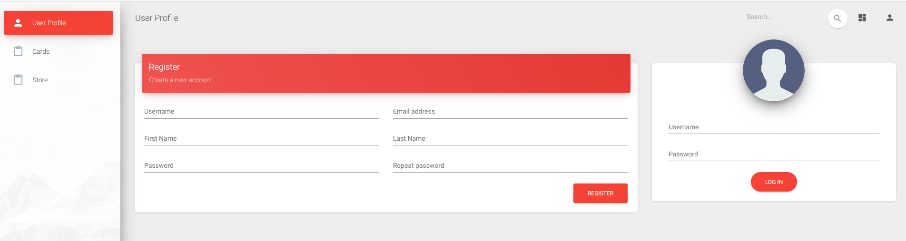

# Projet Micro-services FrontEnd

## Sommaire
- [Introduction](https://github.com/xwawo/PocheCard_Front#introduction)
- [Membres](https://github.com/xwawo/PocheCard_Front#membres)
- [Installation](https://github.com/xwawo/PocheCard_Front#installation)
- [Vidéo de présentation](https://github.com/xwawo/PocheCard_Front#vidéo-de-présentation)


## Introduction

PochemonCard - The Game

### Atelier I

#### Elements realisés du cahier des charges :

*Implémentation de la partie serveur, ses controleurs services associés (Card Service, User Service, Store Service)*

#### Foctionnalités :

*Log in, affichage d'une carte, achat d'une carte, voir la liste des carte en vente, mettre en vente une carte*

#### Elements non realisés :

*Implémentation de la partie client, Interface (UI) . On a testé le serveur avec des appels HTTP sur Postman.*

### Atelier II


## Membres

- Francois Cheval
- Martin Jourjon
- Xavier Gauchoux
- Guth Moelle
- Walid Iqbal


## Installation
### NodeJS
Node est nécessaire pour le lancement du projet, le projet a été développé sous la v16.13.2.
Les informations concernant son installation se trouvent [ici](https://nodejs.org/en/download/)

### Projet FrontEnd
1. Clonage du projet et cd dans le répertoire
```Bash
$ git clone https://github.com/xwawo/PocheCard_Front
$ cd ./PocheCard_Front
```

2. Installation des dépendances
```Bash
$ npm install
```

3. Lancement de l'application
```Bash
$ npm start
```

4. Accès à l'application

   - Via : [https://localhost/](https://localhost:80)

## Vidéo de présentation
[](https://youtu.be/OW3wJ41cr1Y)
